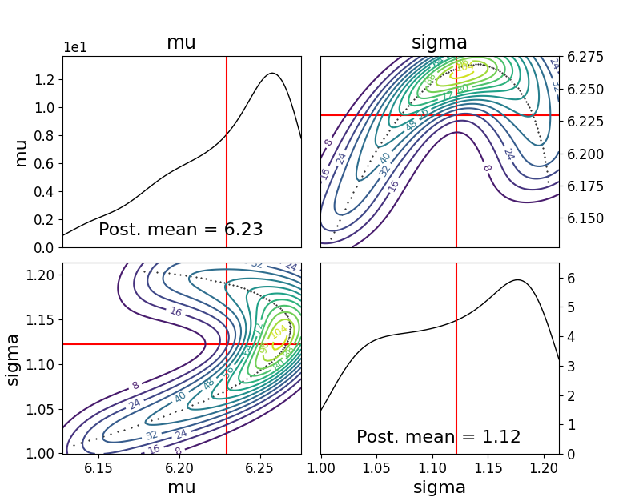

Defining A Model
=====

User defined Model
------------

We give below an example of a user defined model incorporating all of the features needed

.. code-block:: python

    import logging
    from numbers import Number
    import numpy as np
    import scipy
    from abcpy.probabilisticmodels import ProbabilisticModel, Continuous, InputConnector
    import torch
    from torch.autograd.functional import jacobian

    class Gaussian(ProbabilisticModel, Continuous):
        def __init__(self, parameters, name='Gaussian'):
            # We expect input of type parameters = [mu, sigma]
            if not isinstance(parameters, list):
                raise TypeError('Input of Normal model is of type list')

            if len(parameters) != 2:
                raise RuntimeError('Input list must be of length 2, containing [mu, sigma].')

            input_connector = InputConnector.from_list(parameters)
            super().__init__(input_connector, name)
            self.ordered_transforms = [False, torch.exp]
            self.ordered_inverse_transforms = [False, torch.log]

        def _check_input(self, input_values):
            # Check whether input has correct type or format
            if len(input_values) != 2:
                raise ValueError('Number of parameters of Normal model must be 2.')
            # Check whether input is from correct domain
            mu = input_values[0]
            sigma = input_values[1]
            if sigma < 0:
                return False
            return True

        def forward_simulate(self, input_values, k, rng=np.random.RandomState()):
            # Extract the input parameters
            # input_values = self.transform_variables(input_values) # do this outside in inference.
            mu = input_values[0]
            sigma = input_values[1]
            np.array(rng.normal(mu, sigma, k))

            result = self.normal_model_pytorch([float(input_value) for input_value in input_values], k)#[np.array([x]) for x in vector_of_k_samples]
            return result

        def normal_model_pytorch(self, input_values, n, return_grad = False):
            values = []
            for n in range(0,n):
                value = []
                mu = torch.tensor(input_values[0], requires_grad = True)
                sigma = torch.tensor(input_values[1], requires_grad = True)
                variables = [mu,sigma]
                yval = torch.randn(1)*sigma + mu
                value.append(yval.item())
                values.append(np.array(value))
            return values

        def grad_forward_simulate(self, input_values, k, rng=np.random.RandomState()):
            # Takes input in the form:  [a,....,z]
            #print(input_values)
            # Outputs: array: [x1, x2, ...... ,xn, [dx1/dtheta1, dx1/dtheta2], ...... [dxn/dtheta1, dxn/dtheta2],]

            result = self.grad_normal_model_pytorch([float(input_value) for input_value in input_values], k)#[np.array([x]) for x in vector_of_k_samples]
            return result

        def grad_normal_model_pytorch(self, input_values, n, return_grad = False):
            values = []
            gradvalues = []
            for n in range(0,n):
                mu = torch.tensor(input_values[0], requires_grad = True)
                sigma = torch.tensor(input_values[1], requires_grad = True)
                z = torch.randn(1)
                variables = [mu,sigma]
                yval = z*sigma + mu               
        values.append(yval.item())
                yval.backward()
                gradvalue = []
                for var in variables:
                    gradvalue.append(var.grad.item())
                gradvalues.append(gradvalue)
            return values + gradvalues
        
        def _check_output(self, values):
            if not isinstance(values, Number):
                raise ValueError('Output of the normal distribution is always a number.')

            # At this point values is a number (int, float); full domain for Normal is allowed
            return True

        def get_output_dimension(self):
            return 1  

        def jacobian_list(self):
            return self.ordered_transforms
    
        def transform_list(self):
            return self.ordered_transforms

        def inverse_transform_list(self):
            return self.ordered_inverse_transforms

.. module:: ModelFile
   :synopsis: User defined Model

.. class:: UserDefinedModel

    .. py:function:: __init__(parameters: List[Any], name: Optional[str]=None)
    
        When initialising the user-defined model, this function ensures that the model works in the `abcpy` structure by adding the input parameters (either prior pdfs or hyperparameters) into a graph. This graph is then used throughout the graph tools class and elsewhere in the existing `abcpy` structure.
        
        :param parameters: List of parameters.
        :param name: Optional name for the model.

        for example you could initialise your model like this 
        
        .. code-block:: python
        
            mu = Normal([4, 1], name='mu')
            sigma = LogNormal([1,1], name='sigma')
            self.model = Gaussian([mu, sigma], name='GaussianTest')
            
        or
        
        .. code-block:: python
        
            mu = Normal([4, 1], name='mu')
            self.model = Gaussian([mu, 1])
    
    .. py:function:: _check_input(parameter_values: List[Any]) -> bool
    
        Check if the set of possible parameter values for the model are correct.
        
        :param parameter_values: List of potential parameter values.
        :return: Returns True if no errors are detected, and False otherwise.
    
    .. py:function:: forward_simulate(parameter_values: List[Any], n: int) -> List[Any]
    
        Forward simulate the model.
        
        :param parameter_values: List of parameters for the model.
        :param n: Number of required simulations.
        :return: Returns a set of n simulations.
    
    .. py:function:: grad_forward_simulate(parameter_values: List[Any], n: int) -> Tuple[List[Any], List[List[float]]]
    
        Compute the gradient of the forward simulation.
        
        :param parameter_values: List of parameters for the model.
        :param n: Number of required simulations.
        :return: Returns a tuple of simulations and their corresponding gradients.
    
    .. py:function:: _check_output(output_values: List[Any]) -> bool
    
        Check if the output values are in the correct form.
        
        :param output_values: List of output values from the forward simulate function.
        :return: Returns True if the output is correct, and False otherwise.
    
    .. py:function:: get_output_dimension() -> int
    
        :return: Returns the output dimension of the simulator model.
    
    .. py:function:: transform_list() -> List[Union[bool, Callable]]
    
        :return: Returns a list of transformation functions for the model parameters.
    
    .. py:function:: inverse_transform_list() -> List[Union[bool, Callable]]
    
        :return: Returns the inverse of the transformations from `transform_list`.
    
    .. py:function:: Jacobian_list() -> List[Union[bool, Callable]]
    
        :return: Returns the gradient of the transformations from `transform_list`.

You can then use this model as follows 

.. code-block:: python

    import numpy as np
    from abcpy.approx_lhd import EnergyScore, KernelScore
    from abcpy.backends import BackendDummy
    from abcpy.continuousmodels import Normal, LogNormal
    from abcpy.inferences import adSGLD, SGLD
    from abcpy.statistics import Identity
    from Gaussian_model import Gaussian

    # setup backend
    dummy = BackendDummy()

    mu = Normal([5, 1], name='mu')
    sigma = LogNormal([1,1], name='sigma')
    model = Gaussian([mu, sigma])

    stat_calc = Identity(degree=2, cross=False)

    dist_calc = EnergyScore(stat_calc, model, 1)

    y_obs = model.forward_simulate([6,1], 100, rng=np.random.RandomState(8)) 

    sampler = adSGLD([model], [dist_calc], dummy, seed=1)

    journal = sampler.sample([y_obs], 100, 100, 2000, step_size=0.0001, w_val = 300, diffusion_factor=0.01, path_to_save_journal="tmp.jnl")

    journal.plot_posterior_distr(path_to_save="posterior.png")
    journal.traceplot()

running this code creates a variable journal containg details of the run and produces the following traceplot of your samples:

