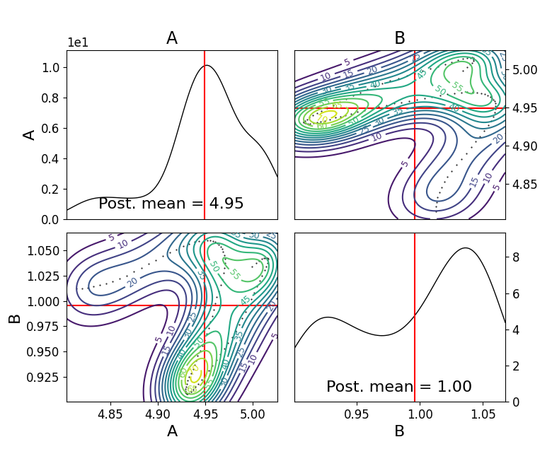

Examples
=====
Example inferences for user-defined Gaussian / G-and-K models

------------

Gaussian model

Say we have a set of observations which we know are generated from a gaussian distribution. We can use the following setup
to infer the model parameters.

.. code-block:: python

    import logging
    from numbers import Number
    import numpy as np
    import scipy
    from abcpy.probabilisticmodels import ProbabilisticModel, Continuous, InputConnector
    import torch
    from torch.autograd.functional import jacobian

    class Gaussian(ProbabilisticModel, Continuous):
        def __init__(self, parameters, name='Gaussian'):
            # We expect input of type parameters = [mu, sigma]
            if not isinstance(parameters, list):
                raise TypeError('Input of Normal model is of type list')

            if len(parameters) != 2:
                raise RuntimeError('Input list must be of length 2, containing [mu, sigma].')

            input_connector = InputConnector.from_list(parameters)
            super().__init__(input_connector, name)
            self.ordered_transforms = [False, torch.exp]
            self.ordered_inverse_transforms = [False, torch.log]

        def _check_input(self, input_values):
            # Check whether input has correct type or format
            if len(input_values) != 2:
                raise ValueError('Number of parameters of Normal model must be 2.')
            # Check whether input is from correct domain
            mu = input_values[0]
            sigma = input_values[1]
            if sigma < 0:
                return False
            return True

        def forward_simulate(self, input_values, k, rng=np.random.RandomState()):
            # Extract the input parameters
            # input_values = self.transform_variables(input_values) # do this outside in inference.
            mu = input_values[0]
            sigma = input_values[1]
            np.array(rng.normal(mu, sigma, k))

            result = self.normal_model_pytorch([float(input_value) for input_value in input_values], k)#[np.array([x]) for x in vector_of_k_samples]
            return result

        def normal_model_pytorch(self, input_values, n, return_grad = False):
            values = []
            for n in range(0,n):
                value = []
                mu = torch.tensor(input_values[0], requires_grad = True)
                sigma = torch.tensor(input_values[1], requires_grad = True)
                variables = [mu,sigma]
                yval = torch.randn(1)*sigma + mu
                value.append(yval.item())
                values.append(np.array(value))
            return values

        def grad_forward_simulate(self, input_values, k, rng=np.random.RandomState()):
            # Takes input in the form:  [a,....,z]
            #print(input_values)
            # Outputs: array: [x1, x2, ...... ,xn, [dx1/dtheta1, dx1/dtheta2], ...... [dxn/dtheta1, dxn/dtheta2],]

            result = self.grad_normal_model_pytorch([float(input_value) for input_value in input_values], k)#[np.array([x]) for x in vector_of_k_samples]
            return result

        def grad_normal_model_pytorch(self, input_values, n, return_grad = False):
            values = []
            gradvalues = []
            for n in range(0,n):
                mu = torch.tensor(input_values[0], requires_grad = True)
                sigma = torch.tensor(input_values[1], requires_grad = True)
                z = torch.randn(1)
                variables = [mu,sigma]
                yval = z*sigma + mu               
        values.append(yval.item())
                yval.backward()
                gradvalue = []
                for var in variables:
                    gradvalue.append(var.grad.item())
                gradvalues.append(gradvalue)
            return values + gradvalues
        
        def _check_output(self, values):
            if not isinstance(values, Number):
                raise ValueError('Output of the normal distribution is always a number.')

            # At this point values is a number (int, float); full domain for Normal is allowed
            return True

        def get_output_dimension(self):
            return 1  

        def jacobian_list(self):
            return self.ordered_transforms
    
        def transform_list(self):
            return self.ordered_transforms

        def inverse_transform_list(self):
            return self.ordered_inverse_transforms

and then call run the following: 

.. code-block:: python

    import numpy as np
    from abcpy.approx_lhd import EnergyScore, KernelScore
    from abcpy.backends import BackendDummy
    from abcpy.continuousmodels import Normal, LogNormal
    from abcpy.inferences import adSGLD, SGLD
    from abcpy.statistics import Identity
    from Gaussian_model import Gaussian

    # setup backend
    dummy = BackendDummy()

    mu = Normal([5, 1], name='mu')
    sigma = LogNormal([1,1], name='sigma')
    model = Gaussian([mu, sigma])

    stat_calc = Identity(degree=2, cross=False)

    dist_calc = EnergyScore(stat_calc, model, 1)

    y_obs = model.forward_simulate([6,1], 100, rng=np.random.RandomState(8))

    sampler = adSGLD([model], [dist_calc], dummy, seed=1)

    journal = sampler.sample([y_obs], 100, 100, 2000, step_size=0.0001, w_val = 300, diffusion_factor=0.01, path_to_save_journal="tmp.jnl")

    journal.plot_posterior_distr(path_to_save="posterior.png")
    journal.traceplot()

To get a posterior plot of the sampled parameters for the mean and standard deviation. Here we generate our y_obs directly from the same 
model, however the user could replace this with any properly formatted dataset and the sampler should converge whenever the prior values of mu and sigma provide reasonable
coverage of the true parameters and he model is properly specified (ie actually normally distributed) (note here that the values for w_val, step_size and burn in may need to be
adjusted to ensure convergence depending on how close your priors are to the true distribution)

We give below another example using the kernelscore with a user defined rbf kernel using the SGLD algorithm

.. code-block:: python

    import numpy as np
    import torch
    from abcpy.approx_lhd import SynLikelihood, EnergyScore, KernelScore
    from abcpy.backends import BackendDummy
    from abcpy.continuousmodels import Normal, LogNormal
    from abcpy.inferences import adSGLD, SGLD
    from abcpy.statistics import Identity
    from Gaussian_model import Gaussian

    def BetaNormNeg(x1, x2):
        assert len(x2.shape) == 1, "x2 should be a 1D tensor"
        assert x1.shape[1:] == x2.shape, "The last dimensions of x1 and x2 should match"
        
        # Subtract x2 from all entries in x1 and compute the beta norm
        diff = x1 - x2
        norm_beta = torch.sum(torch.abs(diff).pow(2), dim=-1).pow(beta/2)
        return -1*norm_beta

    # setup backend
    dummy = BackendDummy()

    # define a uniform prior distribution
    mu = Normal([5, 1], name='mu')
    sigma = LogNormal([1,1], name='sigma')
    model = Gaussian([mu, sigma])

    stat_calc = Identity(degree=2, cross=False)

    beta = 1
    dist_calc = KernelScore(stat_calc, model, BetaNormNeg)

    y_obs = model.forward_simulate([6,1], 100, rng=np.random.RandomState(8))  # Correct

    sampler = SGLD([model], [dist_calc], dummy, seed=1)

    journal = sampler.sample([y_obs], 100, 100, 2000, step_size=0.00001, w_val = 300, diffusion_factor=0.01, path_to_save_journal="tmp.jnl")

    journal.plot_posterior_distr(path_to_save="posterior.png")
    journal.traceplot()

G-and-K Model

We define another user define model below in the form of the g and k model [cite]
The code is provided here:

.. code-block:: python

    import torch
    import logging
    from numbers import Number

    import numpy as np
    import scipy

    from abcpy.probabilisticmodels import ProbabilisticModel, Continuous, InputConnector

    class G_and_K(ProbabilisticModel, Continuous):

        def __init__(self, parameters, name='G_and_K'):
            # We expect input of type parameters = [mu, sigma]
            if not isinstance(parameters, list):
                raise TypeError('Input of Normal model is of type list')

            if len(parameters) != 4:
                raise RuntimeError('Input list must be of length 4, containing [A, B, g, k].')

            input_connector = InputConnector.from_list(parameters)
            super().__init__(input_connector, name)
            self.ordered_transforms = [False, torch.exp, False, False]
            self.ordered_inverse_transforms = [False, torch.log, False, False]

        def _check_input(self, input_values):
            # Check whether input has correct type or format
            if len(input_values) != 4:
                raise ValueError('Number of parameters of Normal model must be 4.')

            # Check whether input is from correct domain
            if input_values[1] < 0:
                return False

            return True
        
        def _check_output(self, values):
            return True
        
        def get_output_dimension(self):
            return 1 

        def g_and_k_quantile(self, y, A, B, g, k):
            c1 = 1/torch.sqrt(torch.tensor(2.0))
            c2 = -1/2
            c3 = -1/(6*torch.sqrt(torch.tensor(2.0)))
            c4 = -1/24
            
            return A + B * (1 + c1*y + c2*y**2 + c3*y**3 + c4*y**4) * (1 + y**2)**k * torch.exp(g*y)

        def forward_simulate(self, params, n, rng=None, to_list=True):
            # Sample from standard normal
            y = torch.randn(n)
            
            # Return quantile values
            if to_list:
                return self.g_and_k_quantile(y, params[0], params[1], params[2],params[3]).tolist()
            else:
                return self.g_and_k_quantile(y, params[0], params[1], params[2],params[3])
            
        def grad_forward_simulate(self,params, n, rng=None):
            
            A, B, g, k = torch.tensor(float(params[0])), torch.tensor(float(params[1])), torch.tensor(float(params[2])), torch.tensor(float(params[3]))
            A.requires_grad_(True)
            B.requires_grad_(True)
            g.requires_grad_(True)
            k.requires_grad_(True)

            samples = self.forward_simulate([A, B, g, k], n, to_list=False)
            grads = []

            for s in samples:
                s.backward(retain_graph=True)
                grads.append((A.grad.item(), B.grad.item(), g.grad.item(), k.grad.item()))
                A.grad.zero_()
                B.grad.zero_()
                g.grad.zero_()
                k.grad.zero_()

            return samples.tolist() + grads

        def transform_list(self):
            return self.ordered_transforms

        def inverse_transform_list(self):
            return self.ordered_inverse_transforms
        
        def jacobian_list(self):
            return self.ordered_transforms

    

and then running the following to infer the the A and B parameter 

.. code-block:: python

        dummy = BackendDummy()
        A = Normal([5, 1], name='A')
        B = LogNormal([1,1], name='B')
        #g = Normal([0, 1], name='g')
        #k = Normal([0, 1], name='k')

        self.model = G_and_K([A, B, 0, 1])

        # define sufficient statistics for the model
        stat_calc = Identity(degree=2, cross=False)

        dist_calc = EnergyScore(stat_calc, self.model, 1)

        # create fake observed data
        self.y_obs = self.model.forward_simulate([5,1,0,1], 100, rng=np.random.RandomState(8))  # Correct
        self.sampler = adSGLD([self.model], [dist_calc], dummy, seed=1)#basic_adSGLD([self.model], [dist_calc], dummy, seed=1)
        journal = self.sampler.sample([self.y_obs], 100, 100, 1000, step_size=0.0003, w_val = 300, diffusion_factor=0.01, path_to_save_journal="tmp.jnl") 
        journal.plot_posterior_distr(path_to_save="posterior.png")
        journal.traceplot()

and we get the following output for our plot, correctly estimating the posterior values 5 and 1 (increasing the 
number of posterior samples will increase the accuracy of this posterior distribution even further)

